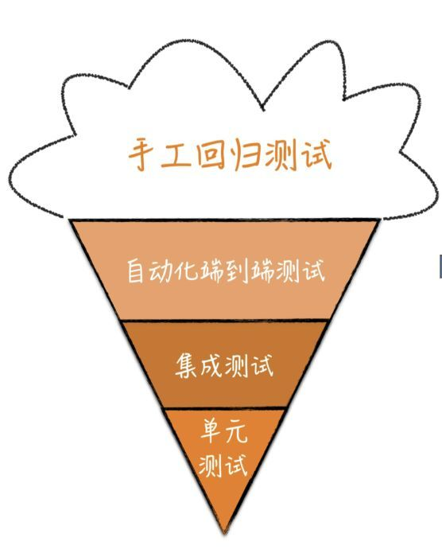
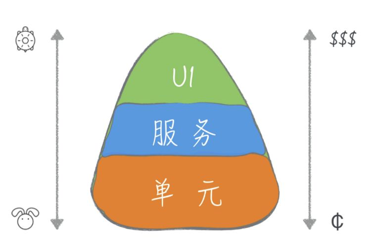

# 单元测试理解  

## 1. 单元的理解  
单元的定义取决于个人，在面向对象的语言中，下至一个方法，上至一个类都可以是一个单元。  

## 2. 测试的分类  
测试有很多种，单元测试，增量测试，集成测试，回归测试，冒烟测试等等，谷歌对于这些种类繁多的测试，创立了一套命名方式  
- 小型测试  
- 中型测试  
- 大型测试 

## 3. 测试比较

|资源 | 小型测试|中型测试|大型测试|  
|:-----:|:-----:|:-----:|:-----:|
网络访问|否|仅访问localhost|是
数据库访问|否|是|是
访问文件|否|是|是
访问用户界面|否|否|是
使用外部服务|否|不鼓励，用mock|是
多线程|否|是|是
使用sleep语句|否|是|是
运行时间限制|60|300|900+
强制时间限制|1|5|15

|    | 小型测试 | 中型测试 | 大型测试 |
|:---:|:------:|:-----:|:----:|
对应的测试类型| 单元测试| 单元测试+逻辑层测试（泛单元测试或分层测试）|UI测试或者接口测试|

结论：可以针对一个函数方法写一个case，也可以按照函数的调用关系串起来写case.

## 4. 测试模型  
1. 冰淇淋模型  
  
雪糕模型中包含大量的手工测试，端到端的测试和集成，单元测试很少，在产品相对简单，功能相对较少的时候，测试的完成也比较快，不会太影响效率。但这样的后果就是，随着产品的壮大，手动回归测试的时间越来越长，质量很难把控，当出现bug时，接口通常有着长长的调用方法链，定位问题复杂。  

2. 金字塔模型  
优秀的测试模型是应该是一个正三角形（金字塔型）
  

图片中的模型分成三层
- UI: 简单理解成接口，对接到前端的数据展示，大型测试
- 服务: 当前代码完成的一整个功能，localhost级别的测试，中型测试
- 单元: 单元测试，一个方法，一些方法，一个类等等。

3. 金子塔模型的理解
- 编写不同粒度的测试
- 层次越高，写的测试用例越少

可以把金字塔模型模型理解为冰淇淋模型融化了，最上方的手动测试全部要向下融化，优先考虑融化成单元测试，单元测试覆盖不了的就放到中间层，在覆盖不了的放到UI层。UI层的case能没有就不要有。单元测试能够覆盖的，就不要上层去覆盖。越是底层的测试，牵扯的东西越少，高层的测试则涉及面更广。单元测试只关注一个单元，只要一个单元写好了，测试就可以通过；集成测试就是要把好几个单元组装到一起才能测试，测试通过的前提是所有的单元都写好，这个周期明显比单元测试要更长。

